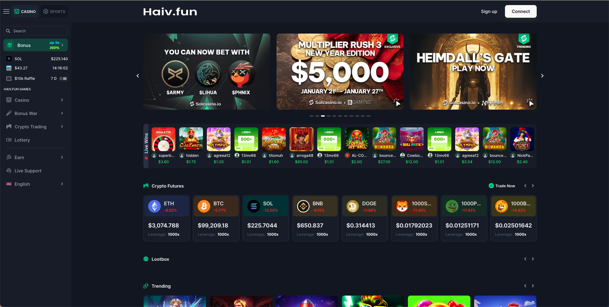

<h1 align="center">Haiv.Fun Casino</h1>
<h2 align="center">Casino</h2>
<h2 align="center">Aapanel/Cpanel/Plesk Casino Server Configuration Guide</h2>

<p align="center">
    
</p>

<p align="center">
    <a href="https://haiv-fun-demo" title="DEMO 1"><strong>DEMO 1</strong></a> &nbsp; | &nbsp;
    <a href="https://polycasino.io/" title="DEMO 2"><strong>DEMO 2</strong></a> &nbsp; | &nbsp;
    <a href="https://t.me/vicckr" rel="nofollow"><strong>TELEGRAM GROUP</strong></a>
</p>

<h3 align="center" style="color: #ff0000;">BEWARE OF ANY FORK/LINK THAT IMPERSONATES OUR OFFICIAL ACCOUNT</h3>

# 🎰 DubCAsino - Fullstack Casino Platform

Welcome to **DubCasino**, a realistic and simulation-based casino backend architecture built for scale, game simulation, and API-first integration.

This project features:

- 🔒 Secure JWT-based backend  
- 🎮 200+ comprehensive game + admin API endpoints  
- ⚙️ Modular game engine (Slots, Blackjack, Roulette, Baccarat, Crash, etc.)  
- 🔧 Admin dashboard configuration  
- 🎛 API-controlled everything  

---

## 📁 Project Structure

```
dubcasino/
├── backend/       # Node.js/Express API for game logic
├── admin/         # Admin panel (React/Next.js)
├── dubcasino/     # Static frontend served with http-server
└── README.md   
```

---

## 📦 Dependencies

- Node.js >= 16  
- MongoDB  
- Redis (optional, for sessions/queues)  
- http-server (`npm install -g http-server`)  
- Docker (optional)  

---

## 🚀 Getting Started

### ▶️ Run Backend

```bash
cd backend
npm install
npm run dev
```

> 🔌 **Backend URL:** `http://localhost:4000`

---

### ▶️ Run Admin Panel

> Contact the team directly for access to the admin panel:  
> Telegram: [https://t.me/vicckr](https://t.me/vicckr)

---

### ▶️ Run Frontend

Use [`http-server`](https://www.npmjs.com/package/http-server):

```bash
cd dubcasino
http-server -p 5000
```

🔗 Access the app at: `http://localhost:5000`  
Be sure backend is running at: `http://localhost:4000`

---

## ❗ CORS Setup for Backend

Modify `backend/app.js`:

```js
const cors = require('cors');
app.use(cors({ origin: 'http://localhost:5000' }));
// Or, to allow all:
app.use(cors());
```

Restart backend after making changes.

---

## 📁 Frontend Directory Structure

```
dubcasino/
├── index.html
├── assets/
├── src/
├── static/
├── wallet/
├── webpack/
└── profile/
```

---

## 📂 js/auth.js (Login Example)

```js
async function login() {
  const res = await fetch('http://localhost:4000/api/auth/login', {
    method: 'POST',
    headers: { 'Content-Type': 'application/json' },
    body: JSON.stringify({
      email: 'player@casino.com',
      password: '123456'
    })
  });

  const data = await res.json();
  localStorage.setItem('token', data.token);
}
```

---

## 📂 js/slots.js (Spin Example)

```js
function spinSlots() {
  const bet = parseInt(document.getElementById('betAmount').value);
  fetch('http://localhost:4000/api/game/slots/spin', {
    method: 'POST',
    headers: {
      'Content-Type': 'application/json',
      'Authorization': `Bearer ${localStorage.getItem('token')}`
    },
    body: JSON.stringify({ bet })
  })
  .then(res => res.json())
  .then(data => {
    document.getElementById('result').innerText = JSON.stringify(data, null, 2);
  });
}
```

---

## 🌐 Port Mapping

| Service        | Port   | Description                |
|----------------|--------|----------------------------|
| Frontend (UI)  | 5000   | Served by `http-server`    |
| Backend (API)  | 4000   | Node.js Express API        |
| Admin Panel    | 3000   | React/Next admin dashboard |

---

## ✅ Testing Checklist

- Check browser DevTools > Network tab  
- Use `console.log()` to debug fetch requests  
- Test using Postman / Insomnia with full URLs  
- Use complete URLs like `http://localhost:4000/api/...`  
- Attach JWT session token in headers for protected routes  

---

## ⚠️ Common Gotchas

| Problem                        | Fix                                     |
|--------------------------------|------------------------------------------|
| CORS errors                    | Enable CORS middleware in backend        |
| 401 Unauthorized login         | Double-check test creds and JWT          |
| API not responding             | Use full backend URL from frontend       |
| http-server shows 404          | Must be run inside `/dubcasino/`         |
| Game routes broken             | Ensure token is sent with each request   |

---

## 🔄 Optional: Auto Reload with `live-server`

```bash
npm install -g live-server
cd dubcasino
live-server --port=5000
```

Supports hot reload while developing frontend.

---

## 🧩 Token & Headers Helper

```js
// utils.js

function getToken() {
  return `Bearer ${localStorage.getItem('token')}`;
}

function apiHeaders() {
  return {
    'Content-Type': 'application/json',
    'Authorization': getToken()
  };
}
```

---

## 🔐 Auth API

| Endpoint             | Method | Description           |
|----------------------|--------|-----------------------|
| `/api/auth/register` | POST   | Register account       |
| `/api/auth/login`    | POST   | Login, get JWT         |
| `/api/auth/logout`   | POST   | Logout user            |
| `/api/auth/refresh`  | POST   | Refresh access token   |

---

## 👤 User API

| Endpoint               | Method | Description              |
|------------------------|--------|--------------------------|
| `/api/user/profile`    | GET    | Get player profile       |
| `/api/user/balance`    | GET    | Get current balance      |
| `/api/user/history`    | GET    | Fetch game history       |
| `/api/user/deposit`    | POST   | Simulate deposit         |
| `/api/user/withdraw`   | POST   | Request withdrawal       |

---

## 💳 Wallet API

| Endpoint                    | Method | Description            |
|-----------------------------|--------|------------------------|
| `/api/wallet/transactions`  | GET    | Transaction logs       |
| `/api/wallet/deposit`       | POST   | Wallet deposit         |
| `/api/wallet/withdraw`      | POST   | Wallet withdraw        |
| `/api/wallet/transfer`      | POST   | User-to-user transfer  |

---

## 🎰 Game APIs (Core Casino Engine)

### 🧿 Slots

| Endpoint                        | Method | Description        |
|---------------------------------|--------|--------------------|
| `/api/game/slots/spin`         | POST   | Spins the slot     |
| `/api/game/slots/history`      | GET    | Spin history       |
| `/api/game/slots/config`       | GET    | Reel setup         |
| `/api/game/slots/leaderboard`  | GET    | Top winners        |

### 🃏 Blackjack

| Endpoint                        | Method | Description         |
|---------------------------------|--------|---------------------|
| `/api/game/blackjack/start`    | POST   | New hand            |
| `/api/game/blackjack/hit`      | POST   | Request card        |
| `/api/game/blackjack/stand`    | POST   | Player stands       |
| `/api/game/blackjack/double`   | POST   | Double down         |
| `/api/game/blackjack/split`    | POST   | Split hand          |

### 🎲 Baccarat

| `/api/game/baccarat/start`     | POST   | Start round         |
| `/api/game/baccarat/history`   | GET    | Match history       |

### 💥 Crash

| Endpoint                   | Method | Description          |
|----------------------------|--------|----------------------|
| `/api/game/crash/bet`     | POST   | Enter crash game     |
| `/api/game/crash/cashout` | POST   | Manual cashout       |
| `/api/game/crash/status`  | GET    | Show current round   |

### 🎲 Dice

| `/api/game/dice/roll`         | POST | Roll the dice        |
| `/api/game/dice/history`      | GET  | History of rolls     |

### 🎡 Roulette

| `/api/game/roulette/bet`      | POST | Place bet on table   |
| `/api/game/roulette/spin`     | POST | Spin the wheel       |
| `/api/game/roulette/result`   | GET  | Last round result    |

### 🃏 Poker

| Endpoint                      | Method | Description            |
|-------------------------------|--------|------------------------|
| `/api/game/poker/join`       | POST   | Join table             |
| `/api/game/poker/bet`        | POST   | Place poker bet        |
| `/api/game/poker/fold`       | POST   | Fold hand              |
| `/api/game/poker/action`     | POST   | Perform action         |

---

## ⚙️ Admin API

### Login

| `/api/admin/login`   | POST   | Admin login           |
| `/api/admin/logout`  | POST   | End admin session     |

### 👥 User Management

| Endpoint                           | Method | Description          |
|------------------------------------|--------|----------------------|
| `/api/admin/users/list`           | GET    | View all users       |
| `/api/admin/users/ban`            | POST   | Ban player           |
| `/api/admin/users/unban`          | POST   | Unban player         |
| `/api/admin/users/adjust-balance` | POST   | Modify balance       |

### 🎮 Game Control

| `/api/admin/games/stats`      | GET  | Overview stats       |
| `/api/admin/games/configure`  | POST | Adjust settings      |
| `/api/admin/games/disable`    | POST | Disable game         |

### 💰 Finance

| `/api/admin/finance/deposits`    | GET | List user deposits    |
| `/api/admin/finance/withdrawals` | GET | View withdrawals       |
| `/api/admin/finance/payouts`     | POST| Manual payout trigger  |

---

## 📄 .env Template

```
PORT=4000
JWT_SECRET=supersecuretoken
DATABASE_URL=mongodb://localhost:27017/casino
TOKEN_EXPIRY=2h
ENABLE_MOCK_PAYMENTS=true
```

---

## 🐳 Docker Deploy (Optional)

```bash
docker-compose up --build
```

🟢 App ports:

| Service     | URL                          |
|-------------|-------------------------------|
| Frontend    | http://localhost:5000         |
| Backend     | http://localhost:4000         |
| Admin       | http://localhost:3000         |

---

## 📌 Roadmap

- ✅ Complete JWT Auth + Game Flow  
- ✅ Slots, Blackjack, Crash, Roulette  
- ✅ Admin Dashboard  
- ✅ Bonus + Leaderboard  
- 🔜 WebSocket Multiplayer  
- 🔜 3rd-party Game Integration  

---

## 💬 Support / Contact
 
- 🧑 Telegram Dev: [https://t.me/vicckr](https://t.me/vicckr)  
- 💬 Discord: Coming soon...

---

Built for scale. Powered by Web3. 💰
